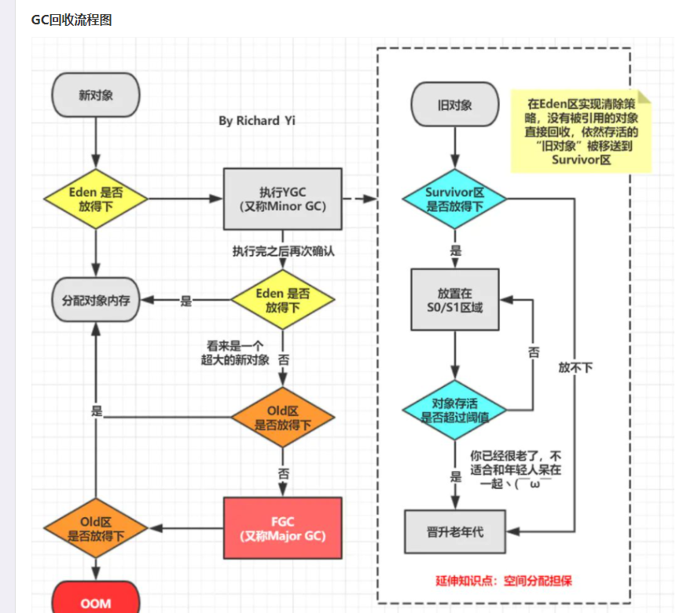

#java中的内存组成
1.寄存器：最快的存储区，由编译器根据需求进行分配，在程序中无法控制
2.栈：存放基本类型的变量数据和对象的引用，但对象本身不存放在栈中，而是存放在堆或者常量池中
3.堆：存放所有new出来的对象
4.静态域：存放静态成员
5.常量池：存放字符串常量和基本类型常量(public static final)
6.非RAM存储：硬盘等永久存储空间

主要关心栈，堆和常量池，对于栈和常量池中的对象可以共享，对于堆中的对象不可以共享。栈中的数据大小和生命周期是可以确定的，
当没有引用指向数据时，这个数据就会消失。堆中的对象的由垃圾回收器负责回收，因此大小和生命周期不需要确定，具有很大的灵活性。
对于字符串：其对象的引用都是存储在栈中的，如果是编译期已经创建好(直接用双引号定义的)的就存储在常量池中，
如果是运行期（new出来的）才能确定的就存储在堆中。对于equals相等的字符串，在常量池中永远只有一份，在堆中有多份。

具体的说：
栈与堆都是Java用来在Ram中存放数据的地方。与C++不同，Java自动管理栈和堆，程序员不能直接地设置栈或堆。
Java的堆是一个运行时数据区,类的(对象从中分配空间。这些对象通过new、newarray、anewarray和multianewarray等指令建立，它们不需要程序代码来显式的释放。
堆是由垃圾回收来负责的，堆的优势是可以动态地分配内存大小，生存期也不必事先告诉编译器，因为它是在运行时动态分配内存的，Java的垃圾收集器会自动收走这些不再使用的数据。
但缺点是，由于要在运行时动态分配内存，存取速度较慢。
栈的优势是，存取速度比堆要快，仅次于寄存器，栈数据可以共享。但缺点是，存在栈中的数据大小与生存期必须是确定的，缺乏灵活性。栈中主要存放一些基本类型的变量
（,int, short, long, byte, float, double, boolean, char）和对象句柄。
栈有一个很重要的特殊性，就是存在栈中的数据可以共享。假设我们同时定义：
int a = 3;
int b = 3；
编译器先处理int a = 3；首先它会在栈中创建一个变量为a的引用，然后查找栈中是否有3这个值，如果没找到，就将3存放进来，然后将a指向3。接着处理int b = 3；在创建完b的引用变量后，
因为在栈中已经有3这个值，便将b直接指向3。这样，就出现了a与b同时均指向3的情况。这时，如果再令a=4；那么编译器会重新搜索栈中是否有4值，如果没有，则将4存放进来，并令a指向4；
如果已经有了，则直接将a指向这个地址。因此a值的改变不会影响到b的值。要注意这种数据的共享与两个对象的引用同时指向一个对象的这种共享是不同的，因为这种情况a的修改并不会影响到b, 
它是由编译器完成的，它有利于节省空间。而一个对象引用变量修改了这个对象的内部状态，会影响到另一个对象引用变量。

String是一个特殊的包装类数据。可以用：
String str = new String("abc");
String str = "abc";
两种的形式来创建，第一种是用new()来新建对象的，它会在存放于堆中。每调用一次就会创建一个新的对象。
而第二种是先在栈中创建一个对String类的对象引用变量str，然后查找栈中有没有存放"abc"，如果没有，则将"abc"存放进栈，并令str指向”abc”，如果已经有”abc” 则直接令str指向“abc”。

比较类里面的数值是否相等时，用equals()方法；当测试两个包装类的引用是否指向同一个对象时，用==，下面用例子说明上面的理论。 
String str1 = "abc";
String str2 = "abc";
System.out.println(str1==str2); //true
可以看出str1和str2是指向同一个对象的。

String str1 =new String ("abc");
String str2 =new String ("abc");
System.out.println(str1==str2); // false
用new的方式是生成不同的对象。每一次生成一个。
因此用第一种方式创建多个”abc”字符串,在内存中其实只存在一个对象而已. 这种写法有利与节省内存空间. 同时它可以在一定程度上提高程序的运行速度，
因为JVM会自动根据栈中数据的实际情况来决定是否有必要创建新对象。而对于String str = new String("abc")；的代码，则一概在堆中创建新对象，而不管其字符串值是否相等，
是否有必要创建新对象，从而加重了程序的负担。
另一方面, 要注意: 我们在使用诸如String str = "abc"；的格式定义类时，总是想当然地认为，创建了String类的对象str。担心陷阱！对象可能并没有被创建！
而可能只是指向一个先前已经创建的对象。只有通过new()方法才能保证每次都创建一个新的对象。由于String类的immutable性质，当String变量需要经常变换其值时，
应该考虑使用StringBuffer类，以提高程序效率。

#堆内存 && GC垃圾回收

当一个新对象创建时，首先会来到新生区的Eden区中，这里进行第一次判断：判断当前新对象是否可以再Eden区放得下，如果放下我们直接放到Eden区分配内存即可；
如果放不下时，就要进行一次Minor GC。此次GC我们展开来详细说一下：回收时进行第二次判断：判断Survivor0是否放得下，如果放得下Eden 区存活对象复制到一个 Survivor0 区，
然后清空 Eden 区，当这个 Survivor0 区也存放满了时，则将 Eden 区和 Survivor0 区存活对象复制到另一个 Survivor1 区，然后清空 Eden 和这个 Survivor0 区，
此时 Survivor0 区是空的，然后将 Survivor0 区和 Survivor1 区交换，即保持 Survivor1 区为空， 如此往复(对照上面两个区域来回切换)。当对象在 Survivor 区躲过一次 GC 的话，
其对象年龄便会加 1，此时进行第三次判断：判断年龄是否达到阈值，默认情况下，如果对象年龄达到 15 岁。超过就会移动到老年代中。不超则继续在Survivor。(对照上图虚线框)
执行完Minor GC后，进行第四次判断：判断Eden区是否放得下，如果放得下就进行内存分配，如果放不下默认作为大对象放到老年区。此时进行第五次判断新对象是否在老年区放得下，
如果放得下就进行内存分配；如果放不下则进行一次Major GC 即 Full GC（执行时间为Minor GC的10倍多），最后进行第五次判断：判断老年区是否放得下，如果放得下进行内存分配；
放不下则直接报异常OOM，此时需要改变堆的内存大小了。

-Xmx：最大堆大小
-Xms：初始堆大小
